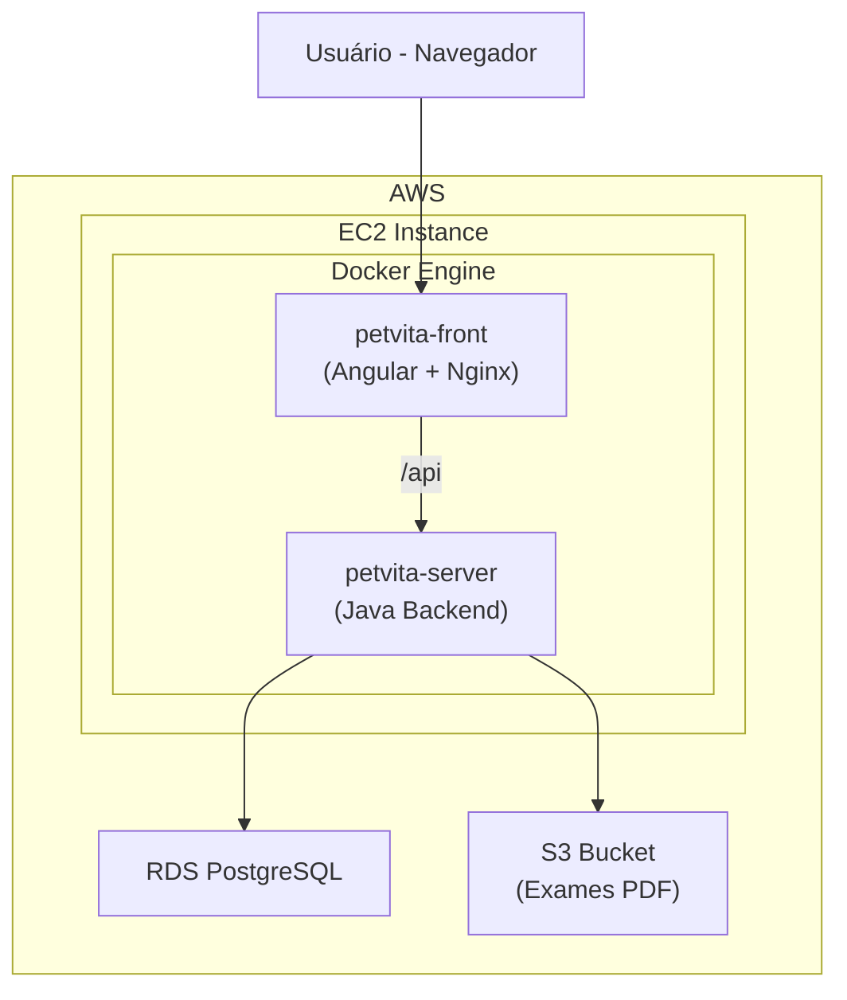

```mermaid
flowchart TB

    User[Usuário - Navegador]

    subgraph AWS
        subgraph EC2["EC2 Instance"]
            subgraph Docker["Docker Engine"]
                Front["petvita-front\n(Angular + Nginx)"]
                Server["petvita-server\n(Java Backend)"]
            end
        end

        RDS["RDS PostgreSQL"]
        S3["S3 Bucket\n(Exames PDF)"]
    end

    User --> Front
    Front -->|/api| Server
    Server --> RDS
    Server --> S3
```