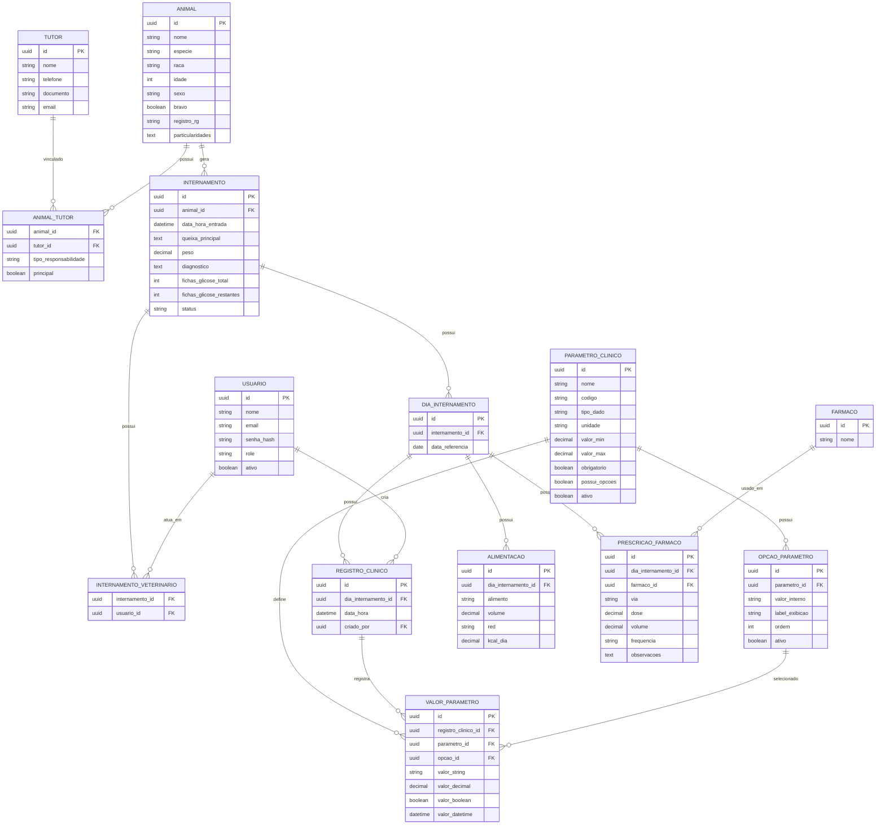

```mermaid
erDiagram

    USUARIO {
        uuid id PK
        string nome
        string email
        string senha_hash
        string role
        boolean ativo
    }

    TUTOR {
        uuid id PK
        string nome
        string telefone
        string documento
        string email
    }

    ANIMAL {
        uuid id PK
        string nome
        string especie
        string raca
        int idade
        string sexo
        boolean bravo
        string registro_rg
        text particularidades
    }

    ANIMAL_TUTOR {
        uuid animal_id FK
        uuid tutor_id FK
        string tipo_responsabilidade
        boolean principal
    }

    INTERNAMENTO {
        uuid id PK
        uuid animal_id FK
        datetime data_hora_entrada
        text queixa_principal
        decimal peso
        text diagnostico
        int fichas_glicose_total
        int fichas_glicose_restantes
        string status
    }

    INTERNAMENTO_VETERINARIO {
        uuid internamento_id FK
        uuid usuario_id FK
    }

    DIA_INTERNAMENTO {
        uuid id PK
        uuid internamento_id FK
        date data_referencia
    }

    REGISTRO_CLINICO {
        uuid id PK
        uuid dia_internamento_id FK
        datetime data_hora
        uuid criado_por FK
    }

    PARAMETRO_CLINICO {
        uuid id PK
        string nome
        string codigo
        string tipo_dado
        string unidade
        decimal valor_min
        decimal valor_max
        boolean obrigatorio
        boolean possui_opcoes
        boolean ativo
    }

    OPCAO_PARAMETRO {
        uuid id PK
        uuid parametro_id FK
        string valor_interno
        string label_exibicao
        int ordem
        boolean ativo
    }

    VALOR_PARAMETRO {
        uuid id PK
        uuid registro_clinico_id FK
        uuid parametro_id FK
        uuid opcao_id FK
        string valor_string
        decimal valor_decimal
        boolean valor_boolean
        datetime valor_datetime
    }

    ALIMENTACAO {
        uuid id PK
        uuid dia_internamento_id FK
        string alimento
        decimal volume
        string red
        decimal kcal_dia
    }

    FARMACO {
        uuid id PK
        string nome
    }

    PRESCRICAO_FARMACO {
        uuid id PK
        uuid dia_internamento_id FK
        uuid farmaco_id FK
        string via
        decimal dose
        decimal volume
        string frequencia
        text observacoes
    }

    TUTOR ||--o{ ANIMAL_TUTOR : vinculado
    ANIMAL ||--o{ ANIMAL_TUTOR : possui
    ANIMAL ||--o{ INTERNAMENTO : gera
    INTERNAMENTO ||--o{ DIA_INTERNAMENTO : possui
    DIA_INTERNAMENTO ||--o{ REGISTRO_CLINICO : possui
    DIA_INTERNAMENTO ||--o{ ALIMENTACAO : possui
    DIA_INTERNAMENTO ||--o{ PRESCRICAO_FARMACO : possui
    FARMACO ||--o{ PRESCRICAO_FARMACO : usado_em
    INTERNAMENTO ||--o{ INTERNAMENTO_VETERINARIO : possui
    USUARIO ||--o{ INTERNAMENTO_VETERINARIO : atua_em
    PARAMETRO_CLINICO ||--o{ OPCAO_PARAMETRO : possui
    PARAMETRO_CLINICO ||--o{ VALOR_PARAMETRO : define
    REGISTRO_CLINICO ||--o{ VALOR_PARAMETRO : registra
    OPCAO_PARAMETRO ||--o{ VALOR_PARAMETRO : selecionado
    USUARIO ||--o{ REGISTRO_CLINICO : cria
```